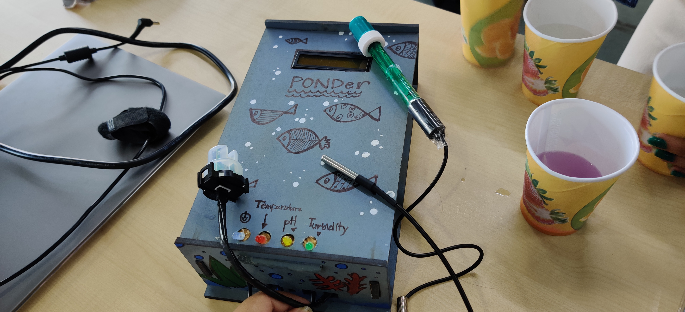

# Project_PONDer

A desktop application that helps to monitor water components which are necessary for fish breeding. 
After measuring the minerals, this application also suggests ways to improve the level of that mineral in water. 
The application works with a hardware console that contains necessary sensors to measure the minerals and the hardware console can be used as standalone device 
as it contains a monitor which shows the current status of water.
This desktop application is made in language "processing".

# Arduino Code
Along with the desktop application code, you can also find arduino code which we used to program our hardware console. The hardware console consists of an arduino uno, temperature sensor, ph sensor and turbidity sensor.

